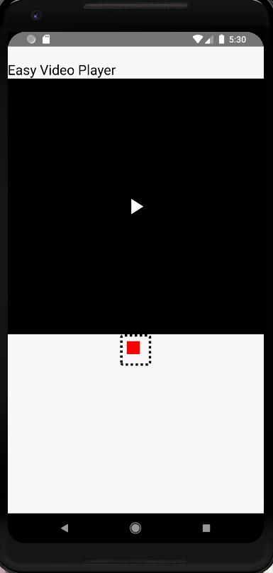
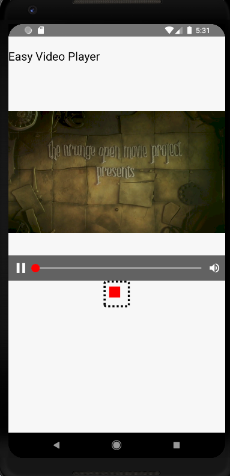

Welcome to React-Native-Easy-Player

There are lot of react-native-video players and packages available but whilst through my development process for an app i faced a lot of issues
and hence i decided to develop a separate component based on several available tutorials.

Credits to them.

use the following component 
>VideoComponent for overall player screen

>VideoPlayer for the player component only

the code can be written as
```javascript
 <VideoComponent videoWidth={640} videoHeight={640}
        url={'http://commondatastorage.googleapis.com/gtv-videos-bucket/sample/ElephantsDream.mp4'}
        duration={634} title={'Easy Video Player'}/>
```

Further more features will be added and developement continued. Thank You!!




##Please install react-native-video and react-native-vector -icons at project level and manually link them by

```
    1) react-native link react-native-video
    2) react-native link react-native-vector icons
```
